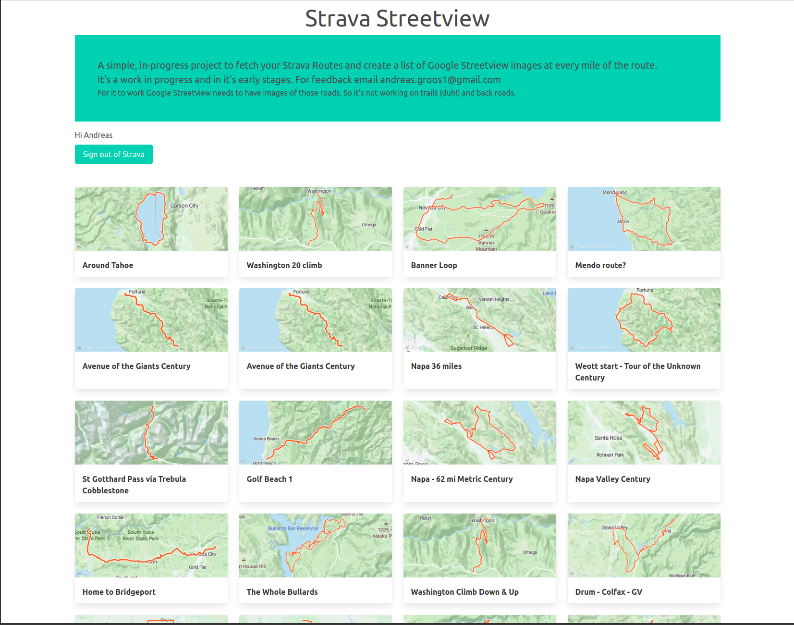

# Strava Streetview Sideproject Introduction

**The project is hosted [https://strava-routes-with-images.vercel.app/](https://strava-routes-with-images.vercel.app/)**

------

## What

Strava is an amazing website and is very popular with cyclists and runners. There is a wide variety of 3rd party websites that add functionality and build on the services and API offered by Strava. `Strava Route with Streetview Images` shows a list of road images from Google Streetview for every mile of a Strava Route.

## Why

Strava offers the ability to build a route based on popularity of roads, but it's hard to judge how the road conditions actually are.
(Short Demo of building a route)...
 I was going to a road trip to Humbold County and was interested in

- road surface quality
- get an overview of the scenery
- shoulder width
- exposure to sun etc
- get inspired to ride

for some routes that I thought would be nice.
  
There currently is no other tool to facilitate that. While it's possible to pull up Google Maps and click on random spots on the map to get an idea it's cumbersome and near impossible on a mobile device.

## Limiting factors

- rate limit of Strava, though they seem open to increase the rate
- free limit on Google Streetview API
- availability of Google Streetview. While it's available for a lot of road some backroads/gravel road are simply not available

## Challenges

- transform a GPX route into GeoJson, NPM package to the rescue

## Technologies

- NextJS with TypeScript
- Strava and Google Streetview API
- Strava SSO with OAuth
- SupaBase DB
- Hosted on Vercel with automatic build on push to `main`
- Vercel Cloudfunctions for data processing etc
- Github action to 'ping' the database every day to prevent it from going inactive

## Next Steps

- Better caching of routes and images to reduce API calls, especially to Google Streetview API
- Better UI
- Sharing capabilities with a URL for a route, static rendering
- URL for the individual user that would be sharable
- Show a map of the route inline with hover over where the images are
- Donate button to offset costs and make some profit

## Questions

Any questions?
